<picture>
  <source media="(prefers-color-scheme: dark)" srcset="dark.svg">
  <source media="(prefers-color-scheme: light)" srcset="light.svg">
  
</picture>

 

**MURANGIRA RICHARD BRILLANT**
Full-Stack Developer | Kigali, Rwanda

---

### About

Full-stack developer focused on building clean, scalable web applications. I work with modern JavaScript frameworks and tools to deliver production-ready solutions.

---

### Skills

**Frontend:** React, Vite, JavaScript (ES6+), CSS3, HTML5

**Backend:** Node.js, Express, REST APIs, Nodemailer

**Tools:** Git, Vercel, npm, Linux

---

### Projects

**Prime Pillar Engineering**
Full-stack web application for a security & engineering company in Rwanda.

- Multi-page SPA with React Router
- 13 service pages with dynamic rendering
- Booking system with email notifications
- Responsive glassmorphism UI
- Deployed on Vercel

---

